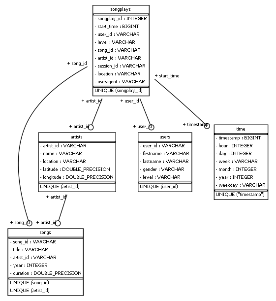

# Project: Data Modeling with Postgres

## Introduction
A startup called Sparkify wants to analyze the data they've been collecting on songs and user activity on their new music streaming app. The analytics team is particularly interested in understanding what songs users are listening to. Currently, they don't have an easy way to query their data, which resides in a directory of JSON logs on user activity on the app, as well as a directory with JSON metadata on the songs in their app.

They'd like a data engineer to create a Postgres database with tables designed to optimize queries on song play analysis, and bring you on the project. Your role is to create a database schema and ETL pipeline for this analysis. You'll be able to test your database and ETL pipeline by running queries given to you by the analytics team from Sparkify and compare your results with their expected results.

## Project Description
This project defines fact and dimension tables for a star schema relating to the sparkify dataset. This project also include the ETL pipeline that transfers data from these source files in two local directories into relevant tables in Postgres using Python and SQL.

The first dataset is a subset of real data from the Million Song Dataset. Each file is in JSON format and contains metadata about a song and the artist of that song. 

The second dataset consists of log files in JSON format generated by this event simulator based on the songs in the dataset above. These simulate activity logs from a music streaming app based on specified configurations.

### Documentation Overview {: .shadow}
This project contains the following documents: 
* [x] Readme.md - overview of the entire project
* [x] create_tables.py - Creates database and all tables nessary for ETL. **Run this first.**
* [x] sql_queries.py - Contains all the SQL queries for the ETL process
* [x] etl.py - Runs the ETL process for both song and log datasets **Run this next.**
* [x] test.ipynb - Contains the sanity checks to be run after etl.py
* [x] Data - folder containing all the data for ETL process. **use the data as it is to run etl.py**
* [x] Reference only: etl_process.ipynb - jupyter notebook to understand the entire ETL process step-by-step - *This can be executed independently to get the same results as etl.py.* **This does not require create_tables.py to be run before**

### CaveatW
> The create_tables.py file uses the primary database as studentdb. Please review this file and ensure your database has suitable login credentials before running this file. 

### Query Check 
>In this current dataset there is only one song that has artist_id, song_id and duration information relevant for the songplays query. After completing etl.py run successfully, run the following query on your database to retrieve that record: 

```SQL 
SELECT * FROM songplays WHERE song_id IS NOT NULL; 
```

### Database Schema
The ERD shown below highlights the various dimension tables and their relationship to the songplay fact table:

>


